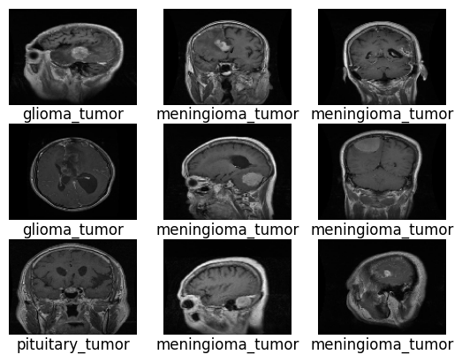
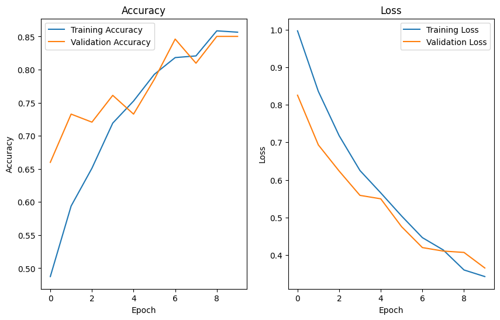

# Brain Tumor Classification using CNN

This repository contains a **Convolutional Neural Network (CNN)** implementation for classifying MRI brain scans into three categories: **Glioma**, **Meningioma**, and **Pituitary Tumor**. The project was originally developed as part of a **Deep Learning Qualification** submission.

---

## Overview

The model is trained on the public [Brain Tumor Classification (MRI)](https://www.kaggle.com/datasets/sartajbhuvaji/brain-tumor-classification-mri) dataset. It aims to identify tumor types based on MRI images, using a simple yet effective CNN built from scratch (no transfer learning).

---

## Model Summary

* **Framework:** TensorFlow / Keras
* **Architecture:** Sequential CNN with convolution, max pooling, and dense layers
* **Loss Function:** Categorical Cross-Entropy
* **Optimizer:** Adam
* **Metric:** Accuracy

---

## Prediction Results

Below are sample MRI images along with their **predicted tumor classes** generated by the trained model.



These examples demonstrate that the model correctly identifies tumor types such as *glioma*, *meningioma*, and *pituitary tumor* from unseen MRI scans.

---

## Training Performance

The model was trained for 10 epochs. The accuracy and loss curves are shown below:



Training and validation accuracy both improved consistently, reaching approximately **85–87%** accuracy, indicating stable learning without significant overfitting.

---

## Results

* **Training Accuracy:** ~0.86
* **Validation Accuracy:** ~0.85
* The model effectively distinguishes between tumor types, performing best on meningioma and pituitary cases.

---

## Repository Structure

```
brain-tumor-classification/
├── brain_tumor_cnn.ipynb
├── results/
│   ├── sample_predictions.png
│   └── training_performance.png
├── README.md
└── LICENSE
```

---

## Future Work

* Add confusion matrix and classification report for deeper evaluation.
* Integrate Grad-CAM for visual interpretability.
* Experiment with transfer learning models (VGG16, ResNet50).

---

## License

MIT License © 2025 Jeremy Sean Sitranata
